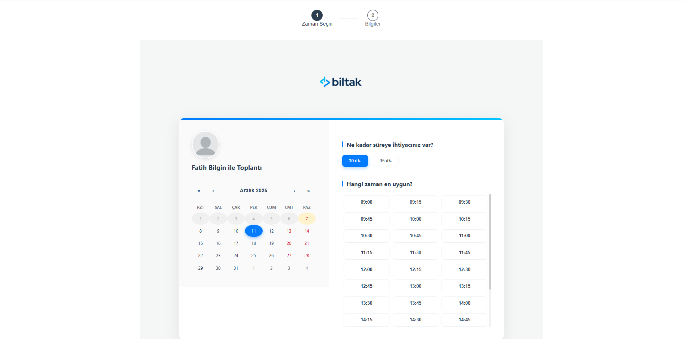
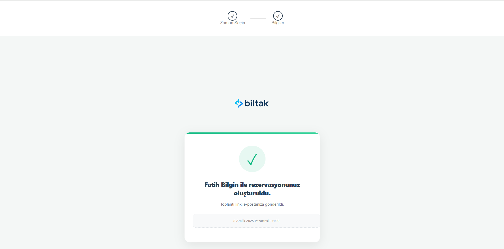

# 📅 Meeting App System | Professional Scheduling Solution

> A full-stack appointment scheduling application built with the **MERN Stack** (MongoDB, Express, React, Node.js), featuring seamless integration with **Google Calendar** and **Google Meet**.

[](https://opensource.org/licenses/MIT)


## 📖 Overview

Meeting App System is designed to streamline the booking process for professionals and businesses. It allows clients to view real-time availability, select a time slot, and automatically generate a Google Calendar event complete with a Google Meet video conferencing link. Both parties receive instant email confirmations.

The project demonstrates advanced full-stack concepts including JWT authentication with access/refresh token rotation, secure third-party API integration (OAuth2), and responsive UI design.

---

## 📸 Screenshots & Workflow

### 1. Time Selection Interface
Users get a modern, intuitive calendar view to choose their preferred date and time slot.

*(Note: Please upload your screenshot named 'screenshot-calendar.png' to the root directory)*

### 2. Secure Booking Form
After selecting a slot, users provide their details via a clean, validated form designed for conversion.

*(Note: Please upload your screenshot named 'screenshot-form.png' to the root directory)*

### 3. Instant Confirmation
Upon success, a confirmation screen is shown, and emails are dispatched instantly with the Google Meet link.

*(Note: Please upload your screenshot named 'screenshot-success.png' to the root directory)*

---

## ⚡ Key Features

* **⚛️ Full-Stack MERN Architecture:** Monorepo structure managed with Git.
* **🔄 Google Calendar & Meet Integration:** Automatically creates events and video links in real-time using Google APIs.
* **🛡️ Advanced Security:** Implemented **JWT (JSON Web Token)** authentication with a secure **Refresh Token** mechanism for seamless user experience.
* **📧 Automated Email Notifications:** Uses **Nodemailer** to send booking confirmations containing meeting details.
* **🎨 Modern UI/UX:** Built with React, featuring a clean, responsive design with modern CSS practices.
* **🗄️ MongoDB Database:** Efficiently stores appointment details and user data.

---

## 🏗️ System Architecture & Data Flow

1.  **Client (React):** User selects date/time and submits the booking form.
2.  **Server (Node.js/Express):** Receives the request and validates the JWT token.
3.  **Google API:** The server authenticates with Google via OAuth2 and requests the creation of a Calendar event with a Meet link.
4.  **Database (MongoDB):** Once Google confirms, appointment details are saved to the database.
5.  **Notification (Nodemailer):** The server sends confirmation emails to both the host and the client.
6.  **Response:** A success message is sent back to the React client to display the confirmation screen.

---

## 🛠️ Tech Stack

| Domain | Technologies |
| :--- | :--- |
| **Frontend** | React.js, React Router, React Calendar, Modern CSS3 |
| **Backend** | Node.js, Express.js |
| **Database** | MongoDB, Mongoose ODM |
| **Authentication**| JWT (JSON Web Tokens), bcryptjs |
| **APIs & Tools** | Google Calendar API, Google Meet, Nodemailer, dotenv |

---

## 🚀 Getting Started (Installation)

### Prerequisites
* Node.js (v14+ recommended)
* MongoDB installed locally or a MongoDB Atlas URI
* Google Cloud Console credentials (Client ID & Secret) for Calendar API

### 1. Clone the Repository
```bash
git clone [https://github.com/fatihbilgin1/meeting-app-system.git](https://github.com/fatihbilgin1/meeting-app-system.git)
cd meeting-app-system
2. Setup Backend (Server)
Bash

cd server
npm install
Create a .env file in the server directory based on .env.example and fill in your credentials:

Kod snippet'i

PORT=8081
MONGODB_URI=your_mongodb_connection_string
JWT_SECRET=your_super_secret_key
GOOGLE_CLIENT_ID=your_google_client_id
GOOGLE_CLIENT_SECRET=your_google_client_secret
MAIL_USER=your_email_address
MAIL_PASS=your_email_app_password
Start the server:

Bash

npm start
3. Setup Frontend (Client)
Open a new terminal window:

Bash

cd client
npm install
npm start
The application will run on http://localhost:3000.

👤 Author
Fatih Bilgin

Full-Stack Developer aimed at defense industry solutions.

GitHub Profile

This project is open-source and available under the MIT License.
